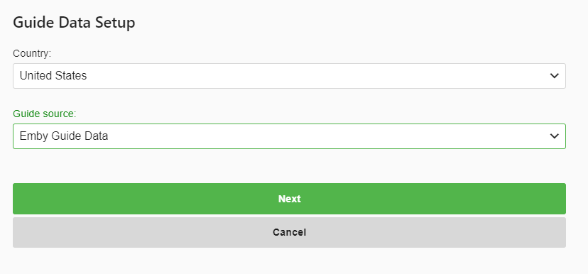
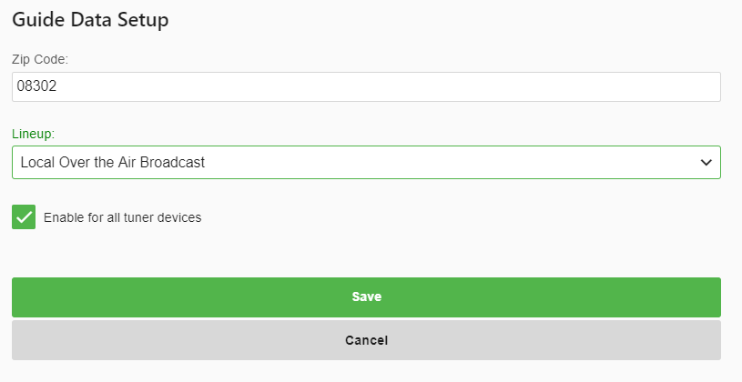

Emby has built in guide data for the United States, Canada and the United Kingdom. If you live in one of these areas then Emby Guide Data should be your first choice of providers to use.  Unlike other guide solutions, everything needed to use is built right into your Emby Server with no 3rd party setup or payments needed.

Emby Guide Data not only includes the basic data provided by other solutions but also has full descriptions of shows,  movies, news and sporting events.  The difference in guide data will be especially noticeable for sports fans! Not only does Emby’s internal solution deliver a rich assortment of information but it also provides posters and artwork delivered from a very fast content delivery network which allows your server to load this data very quickly!

Once you have at least one tuner in Emby, it's time to add your Guide data.

Click the PLUS SIGN next to TV Guide Data Providers.

Select your Country (United State, Candar or United Kingdom)
Select Emby Guide Data as the guide source.
Click Next

