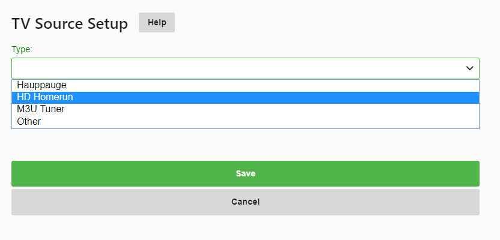

Emby has native support for Silicon Dust HDHomeRun Network Tuners. Unlike other brands of tuners, HDHomeRun tuners run as standalone devices connected to your network. No need to have open PCI slots available in your server or free USB ports. Being a standalone device allows you to install these in close proximity to your OTA antenna or cable drop. As long as you can connect the device to your home Ethernet network you can install them anywhere in your home. Silicon Dust makes both OTA (Over the Air) models as well as Cable Tuners (using Cable Cards) to Receive DRM free digital cable subscription channels.

In most cases, Emby can automatically discover your HDHomerun devices on your network with no configuration required. You can also manually setup a tuner as well. 

The following guide assumes you have already setup your HDHomeRun on your network and have connected it to your cable or antenna.

Open the server dashboard and click the Live TV menu option on the left.  If you haven't setup any part of Live TV yet you should have a page that looks like this:

Click the plus sign next to TV Source in order to add our first tuner. We will then be presented with a screen that allows us to choose the type of tuner to add.  Select HD HomeRun from the drop down list of choices and then click the save button.

Emby will search your network and present all HDHomeRun devices it finds on your network.  Here is a example showing two Primes and one Quatro automatically found.

In this example we are going to setup OTA (Over the Air) using the HDHomeRun Quatro. Click the Quatro (3rd on this list). 

Emby will start the setup of this tuner and will provide you with the ability to set a couple of options including:
The ability to import all channels or only FAVORITE channels (already configured on the tuner itself).  See configuration of HDHomeRun favorites below for more information on using favorites.

The ability to use hardware transcoding on your tuner.  Note: this is only supported on HDHomeRun EXTEND models.

For this example using a Quatro we will enable the restriction of favorite channels and disable the hardware transcoding option. Once we’ve set our options the click save button and we will have added our first tuner. 

Emby has native support for Silicon Dust HDHomeRun Network Tuners. Unlike other brands of tuners, HDHomeRun tuners run as standalone devices connected to your network. No need to have open PCI slots available in your server or free USB ports.  Being a standalone device allows you to install these in close proximity to your OTA antenna or cable drop.  As long as you can connect the device to your home Ethernet network you can install them anywhere in your home. Silicon Dust makes both OTA (Over the Air) models as well as Cable Tuners (using a cable card) to Receive DRM free digital cable subscription channels.

In most cases, Emby can automatically discover your HDHomerun devices on your network with no configuration required. You can also manually setup a tuner as well. Simply open the server dashboard, navigate to Live TV, then click Add underneath tuner devices.

On the HD Homerun setup screen, you'll need to enter the IP Address of your HDHomerun Network Tuner.

There are also additional options, such as the ability to allow hardware video transcoding by the tuner, if it supports that. In most cases, trusting the default settings will be the best option.