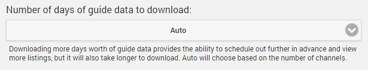

## Overview of Setup

Setup of Live TV can be broken down into a few steps:
* Configure your TV Tuner(s) or M3U based IPTV sources
* Add TV Guide Data Source(s)
* Match your channels to Guide Data

## Configure Your TV Tuner

Out of the box, Emby Server currently supports the following TV Tuners:

* [HDHomerun Network Tuner](HDHomeRun-Setup) (Models available for both OTA and Cable)
* Hauppauge TV Tuners (on Emby Server for Windows)
* [M3U files (or urls)](M3U-Tuners). See examples of m3u files at http://xmtvplayer.com/build-m3u-file

Support for additional tuners can be added by installing a [Live TV Plugin](Live-TV-Plugins).

In most cases, Emby Server will automatically discover your HDHomerun on your network with no configuration required. You can manually add a tuner as well.  Simply open the server dashboard, navigate to **Live TV**, then click **Add** underneath tuner devices.

## Add a TV Guide Data Source

Out of the box, Emby Server currently supports the following TV Guide data sources:

* [Emby Guide Data](Emby Guide Data)  (United States, Canada and United Kingdom)
* [Schedules Direct](Schedules-Direct)
* [Xml TV](Xml-Tv)

Support for additional sources can be added by installing a [Live TV Plugin](Live-TV-Plugins).

## Manual Refresh Guide Data

There is also the ability to manually refresh Guide data. This is normally run automatically and it is generally not needed for manual use, but it is provided here as a convenience.

## Settings

The **Settings** tab allows you to configure how many days of guide data to download and display. More guide data provides a richer experience but may increase loading times.

