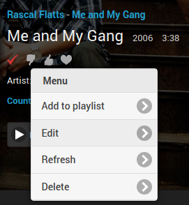

One of the areas in which MediaBrowser shines as a media server is the metadata. The server has a metadata manager which allows you to view all of the metadata for every item in your library in one place.

The metadata manager can be accessed via the slideout in the web client in the top left hand corner of the screen.

Another way to access the metadata manager is via **Options**->**Edit** of the item you would like to edit. Using this method takes you directly to the editor for the that item.

##Using the Metadata Manager

Once you are in the metadata manager, you can edit whatever fields you would like. Be sure to select **Save**; otherwise, all of your changes will be lost. If you wish for the changes that you made to be persistent through a refresh of the item, you will need to either lock the metadata field you changed, or lock the entire item.

If you have a TV show, movie, or music album that has not been identified correctly, you can use the **Identify** option to search for that item in the corresponding databases. Another way to manually force an identification for an item is to manually enter the database ID and clicking refresh.

##Navigation

Navigating through the metadata manager is quite simple. On the left hand side of the screen is menu that allows you to see all of your media sorted by library. Simply click on the triangles next to the library item to access content deeper in your libary.

##Tags and Parental Controls

One trick that you can use to prevent unwanted access to certain content is to use the **Tags** metadata field.

Say you have some content rated G that you don't want your child to see. You can't really use the **Maximum allowed parental rating** option as it would not allow your child to see anything. Instead, you can simply tag the content with the tag **not-for-child**. Then use the option found in **Dashboard**->**Users**->**{Username of child}**->**Parental Control**->**Block items with tags** to block access to the content tagged **not-for-child**.

You should then lock the **Tags** metadata field to ensure that it doesn't randomly disappear.