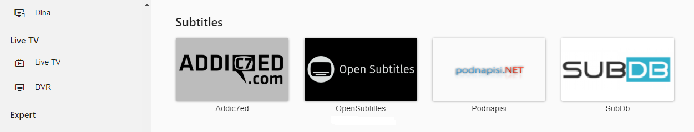
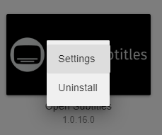
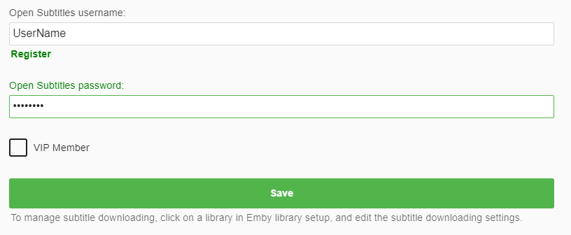
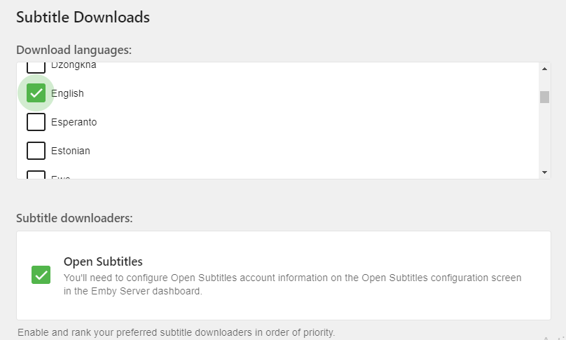
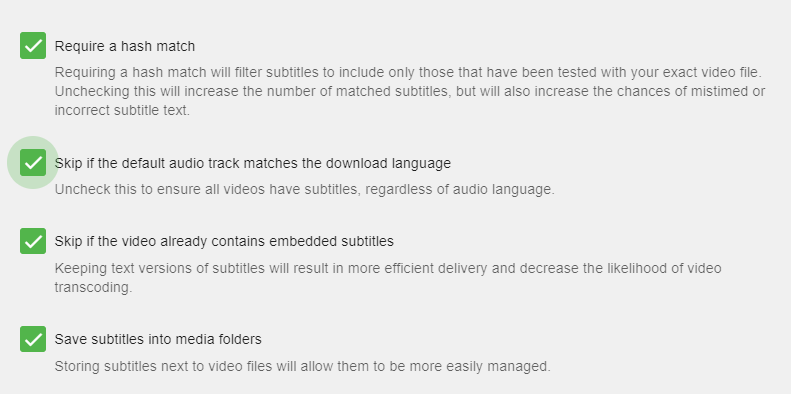

Emby can automatically download subtitle files for your media.  This requires the loading of a plugin and proper setup of your libraries which is shown below.

## Install the Open Subtitle Plugin
To install the plugin, click Plugins in the side-bar menu of the Emby server (Expert Menu) dashboard. Now click the Catalog link at the top of the main page.

Scroll down to the Subtitles section of the catalog to find the Open Subtitles plugin.

You can now click the Open Subtitle entry to bring up the install interface. This will allow you to install the plugin for the first time or to upgrade to the latest version.

You will normally want to choose the latest version in the drop down and then click the install button.  You will see a message on the web dashboard to restart your Emby server to install any new plugins.  Go ahead and restart your Emby server to continue.

## Configure Open Subtitle plugin
After restarting your server, navigate back to the plugin section of the dashboard.  This time make sure to select the "My Plugins" link at the top of the main plugins page.  Once you find the OpenSubtitles plugin click on it and select the Settings option as shown below.

Simply fill in your Open Subtitles username and password that you have previously created at [opensubtitles.org](http://www.opensubtitles.org). If you are a Open Subtitle VIP member also make sure to click the VIP checkbox.  Click the Save button once complete

## Setup your libraries to use Open Subtitles
Once you've installed the Open Subtitle plugin, restarted the server and configured the plugin you are ready to configure each of your libraries to use the plugin.

You can now edit or setup a new library.  When editing a library make sure to click the top right option "show advanced settings".  You can now scroll down to find the following items.

There are two options shown above.  You will want to configure the language preference of any subtitles you want to download.  The above picture shows English subtitles chosen for download.

The second option will show any subtitle plugins you may have installed.  In this case only Open Subtitles is shown and selected.

The above picture shows several options available for you to configure. These should be self explanatory with possibly the exception of "Require a hash match".

Subtitles will now be downloaded as needed when available, via the Download Subtitles [Scheduled Task](Scheduled-tasks).

Note: Emby also supports other subtitle providers. You can always find the latest list in the [Plugins](Plugins) Catalog.
