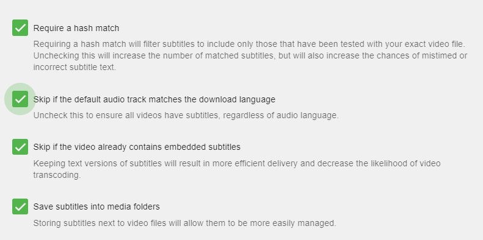

Emby can automatically download subtitle files for your media.  There are multiple subtitle plugin that can be used.

## Setup your libraries to download subtitles
Once you've installed a subtitle plugin, restarted the server and configured the plugin you are ready to configure each of your libraries to use the plugin.

You can now edit or setup a new library.  When editing a library make sure to click the top right option "show advanced settings".  You can now scroll down to find the following items.

There are two options shown above.  You will want to configure the language preference of any subtitles you want to download.  The above picture shows English subtitles chosen for download.

The second option will show any subtitle plugins you may have installed.  In this case only Open Subtitles is shown and selected.

The above picture shows several options available for you to configure. These should be self explanatory with possibly the exception of "Require a hash match". If this option is enabled as shown, then subtitles will ONLY be downloaded when your media file matches EXACTLY "byte for byte" with the Open Subtitle's database.  If you're ripping your own titles or using the DVR service to record files you will never get a hash match and will not be able to use this option.

Subtitles will now be downloaded as needed when available, via the Download Subtitles [Scheduled Task](Scheduled-tasks).

## Tips
Emby supports other subtitle providers besides Open Subtitles. You can find the latest list in the [Plugins](Plugins) Catalog.

When "Require a hash match" is not selected you will often download subtitles that are slightly off in timing.  There is NO WAY for Emby to know for example if you have opening credits or not or if the subtitle file was built with opening credits.  Typically timing issues are best fixed by manually downloading different subtitles and testing them.  There is no way for Emby to know what setting is best for YOUR ENVIRONMENT so you will need to test this setting and adjust as needed.
